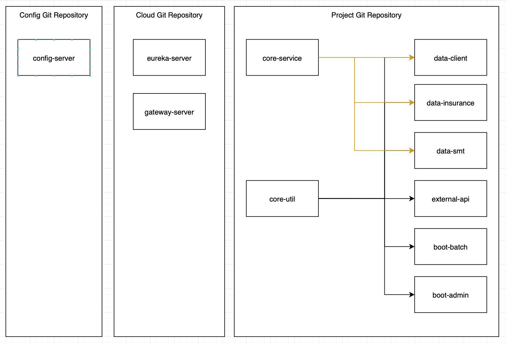

# Multi-module demo project

## Module 구조
* **core** (네이밍 : core-$)
  * 공통 모듈 (ex. util, interface 등)
* **data** (네이밍 : data-$)
  * 스몰티켓, 보험사, 클라이언트 API 모듈 (ex. smt, 배민, kb)
* **external-api**
  * 외부 서버와의 통신을 위한 모듈. (ex. 보험사 VPN)
* **boot** (네이밍 : boot-batch-$, boot-admin-$)
  * 기타 모듈 (ex. batch, admin)
* **front** (네이밍 : front-$)
  * 프론트 페이지 모듈



## Team Config
* Convention (smallticket-style.xml)
  * Java - https://google.github.io/styleguide/javaguide.html
  * Kotlin - https://kotlinlang.org/docs/coding-conventions.html
* Ktlint
  * Git-hook pre-commit을 통해 커밋 전 자동 문법 수정

## Team Config 설정
### Ktlint Git Pre-commit 등록
```shell
./gradlew addKtlintCheckGitPreCommitHook
```

### Intellij Settings 설정
```
Intellij -> File -> Manage IDE Settings -> Import Settings...

./team-config/settings/intellij-all-settings.zip 선택
```

### Intellij Code Style 설정
```
Intellij -> Settings -> Editor -> Code Style -> Setting Icon -> Import Scheme -> Intellij IDEA code style xml

./team-config/code-style/smallticket-style.xml 선택
```

## Git Commit Convention

### 메세지 구조
```
Message : 타입 - 요약
Description : 본문
```
### 타입
* feature - 새로운 기능 추가
* fix - 버그 수정
* docs - 문서 수정
* style - 코드 포맷팅
* refactor - 코드 리팩토링
* test - 테스트 코드
* build - Gradle 등 빌드 관련 처리